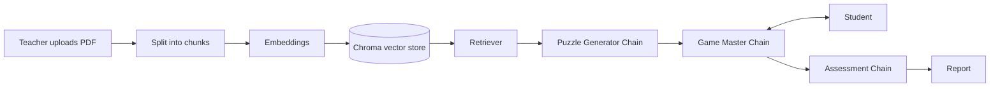

 AI Educational Escape Room Game Master

Turn any curriculum PDF into an interactive escape-room game. A teacher uploads a book or lesson, and an AI Game Master generates curriculum-based puzzles, plays a dramatic character with the student, gives graded hints, and finally assesses how well the student understood the material.

**Live demo:** _[add your Streamlit link here](https://ai-educational-escape-room-2yecxhssqx7bitcuz9udbi.streamlit.app/)_

////The Idea

Traditional quizzes (multiple choice) test memorization. This project tests **understanding**: the student must reason about the curriculum to open the door, while an AI character guides them through a story.

//// Features

| Feature | Description |
|---|---|
**Curriculum upload (RAG)** | The teacher uploads a PDF. It is split into chunks, embedded, and stored in a vector database so every puzzle is grounded in the book, not in the model's general knowledge. |
 **Puzzle Generator Chain** | Retrieves the relevant chunks for a chosen topic and creates a story scene plus a reasoning puzzle (cause-and-effect, scenario, cipher). No multiple choice. |
 **Dynamic Game Master Chain** | Talks to the student as a dramatic character. Accepts answers phrased in the student's own words and never reveals the secret answer. |
 **Graded hint system** | Three hint levels: 1 = vague pointer, 2 = narrower clue, 3 = strong clue (never the answer). |
 **Assessment Chain** | Reads the whole interaction (wrong attempts, hints used, misconceptions) and produces a report: score, strengths, gaps, feedback, and topics to review. |
**Renewable puzzles** | A new puzzle can be generated for any topic and difficulty (1-5) from the same book. |
 **Bilingual** | Puzzles and feedback in English or Arabic; the Game Master replies in the language the student writes in. |
**Structured outputs** | Every chain returns validated JSON through an Output Parser, so the app can reliably read the AI's answers. |

##  Architecture



Each chain follows the same LangChain pattern:

```
prompt | LLM | PydanticOutputParser
```

### Chains and their output schemas

- **Puzzle Generator** → `Puzzle`: title, scene, puzzle_type, question, answer, key_concept, difficulty
- **Game Master** → `GMReply`: message, is_solved, hint_level
- **Assessment** → `Assessment`: understanding_score, attempts, hints_used, strengths, gaps, feedback, review_topics

### State management

Streamlit `session_state` stores the current puzzle, the conversation history, the highest hint level used, and the solved flag, so the game continues correctly across interactions.

## Tech Stack

- **LLM:** Google Gemini (`gemini-3.1-flash-lite`)
- **Embeddings:** Gemini Embedding (`gemini-embedding-001`)
- **Framework:** LangChain (chains, prompts, output parsers)
- **Vector store:** Chroma
- **PDF loading:** PyPDF
- **Validation:** Pydantic
- **UI:** Streamlit

## Project Structure

```
.
├── app.py             # Streamlit app: RAG + 3 chains + UI
├── requirements.txt   # Python dependencies
└── README.md
```

## Run Locally

```bash
git clone https://github.com/anouran949-create/AI-Educational-Escape-Room.git
cd AI-Educational-Escape-Room
pip install -r requirements.txt
streamlit run app.py
```

Provide your Google API key either in the sidebar field, or in `.streamlit/secrets.toml`:

```toml
GOOGLE_API_KEY = "your-key-here"
```

> Never commit your API key to GitHub.

##  How to Play

1. **Teacher:** upload a curriculum PDF and click **Index curriculum**.
2. Choose a **topic**, **language**, and **difficulty**, then click **New puzzle**.
3. **Student:** read the scene, answer in your own words, or type "give me a hint".
4. When the door opens (or you give up), click **Finish and assess** to get the report.

## Known Limitations

- The free Gemini tier has rate limits, so indexing a large book takes a few minutes (the app indexes in batches and waits between them).
- The index lives in the session memory; refreshing the page requires indexing again.
- Puzzle quality depends on the quality of the PDF text extraction.

## Future Work

- Separate teacher and student screens
- Save indexed curricula and student reports in a database
- Multi-room games with progressive difficulty
- Leaderboards and class-level analytics for teachers
